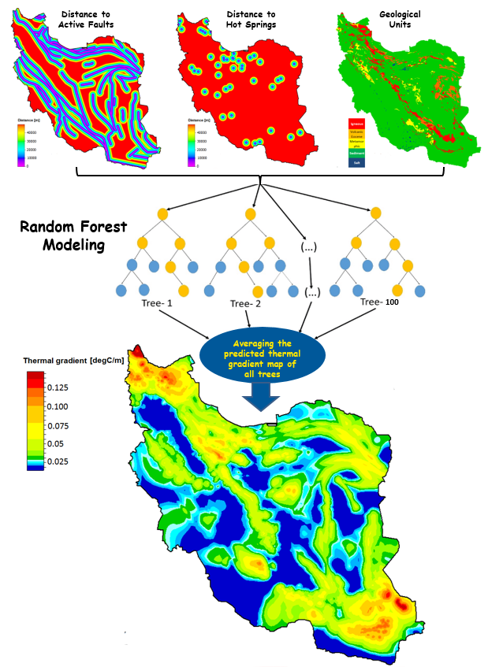
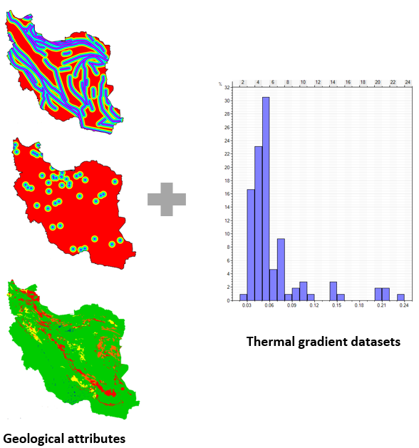
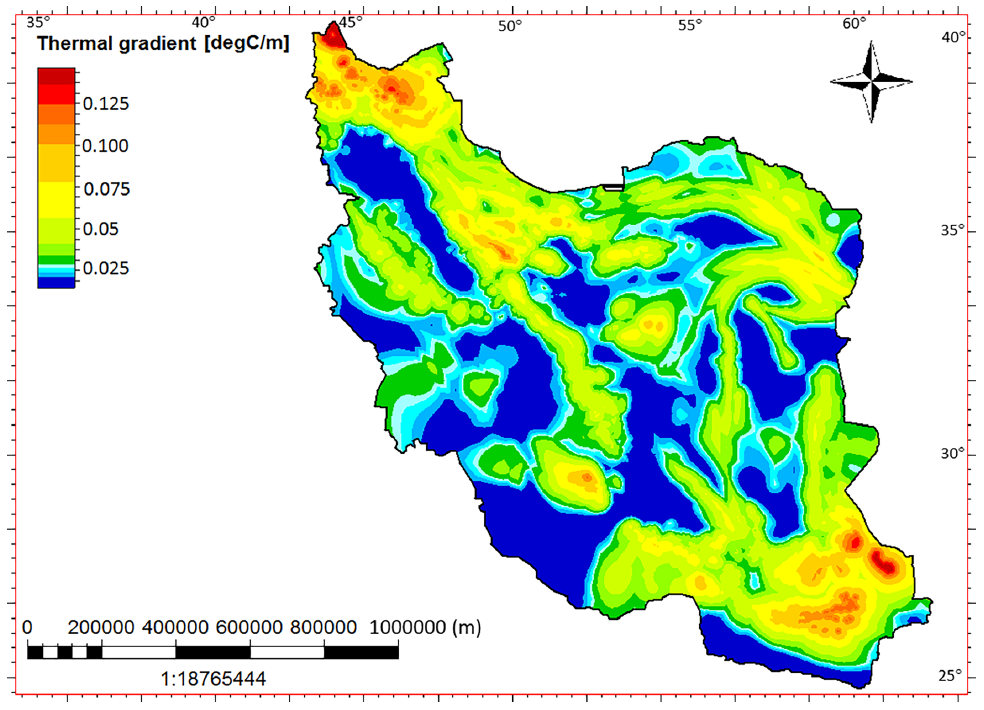

# Developing the geological-based geothermal map of Iran by Random Forest

The earliest and most recent continuous geothermal gradient map of Iran was created by Kelishami and Rezaei, 2022 This map was prepared by interpolating a large amount of data, including processed temperature data from 107 oil, gas, and deep water wells, as well as geothermometry analysis results from hot springs The goal of the current study is to enhance the initial proposed geothermal gradient map by incorporating geological features and machine learning method.

Part of my paper: Rezaei, M., Bahramali Asadi Kelishami, S., & Sangin, S. (2024). Iran's comprehensive heat flow map generated by the Random Forest method and the Sequential Gaussian Simulation. Geothermics, 118, 102915. https://doi.org/10.1016/j.geothermics.2024.102915.



Flowchart of the Random Forest method for generating geological-based geothermal gradient map.


```python
import numpy as np
import pandas as pd
```

## Training

### Loading Training Data
After generating geological attributes (distance from active faults, distance from hot springs, and geological facies) in Petrel I exported them and used the value at the locations where we had geothermal gradient data as training data.




```python
file = pd.read_excel('GradForTrain.xlsx')
data = file.to_numpy()
inputs = data[:, :3]
outputs = data[:, 3]
```

### Shufflling


```python
per_list = np.random.permutation(len(data))
inputs_sh = []
outputs_sh = []
for i in range(len(data)):
    per_indx = per_list[i]
    tmp_input = inputs[per_indx]
    tmp_output = outputs[per_indx]
    inputs_sh.append(tmp_input)
    outputs_sh.append(tmp_output)

inputs_sh = np.array(inputs_sh)
outputs_sh = np.array(outputs_sh)
```

### Normalizing


```python
min_vec = inputs_sh.min(axis=0)
max_vec = inputs_sh.max(axis=0)
inputs_sh = (inputs_sh - min_vec)/(max_vec - min_vec)
```

### Train Test Split


```python
trn_test_split = int(0.75*len(inputs_sh))
X_train = inputs_sh[0:trn_test_split, :]
Y_train = outputs_sh[0:trn_test_split]

X_val = inputs_sh[trn_test_split :, :]
Y_val = outputs_sh[trn_test_split :]
```

After splitting 25% of the data for validation, the authors used R2 score and mean square error analysis on both the training and validation datasets to determine the optimal values of m and k. Through multiple experiments, it was found that the values of 2 for m and 100 for k resulted in the highest R 2 score and the lowest MSE for both the training and validation datasets. Consequently, the Random Forest modeling was carried out using 100 decision trees, with each node having two adjacent nodes below it.


```python
from sklearn.ensemble import RandomForestRegressor
Rf = RandomForestRegressor(n_estimators=100, min_samples_split=2) Rf.fit(X_train, Y_train)

print('train accuracy : ', Rf.score(X_train, Y_train))
print('val accuracy : ', Rf.score(X_val, Y_val))

train_pred = Rf.predict(X_train)
test_pred = Rf.predict(X_val)

from sklearn.metrics import r2_score
R2_train = r2_score(Y_train, train_pred)
R2_test = r2_score(Y_val, test_pred)

from sklearn.metrics import mean_squared_error
mse_train = mean_squared_error(Y_train, train_pred)
mse_test = mean_squared_error(Y_val, test_pred)

```

## Prediction

### Loading and preparing Prediction Data
Here we import geological attributes that cover whole Iran's land area and are in GSLIB format.


```python
def read_gslib(filename:str):
    with open(filename, "r") as f:
        lines = f.readlines()
        ncols = int(lines[1].split()[0])
        col_names = [lines[i+2].strip() for i in range(ncols)]
        df = pd.read_csv(filename, skiprows=ncols+2, delim_whitespace= True, names= col_names)
        return df

df = read_gslib(filename="Geoth_Forprid_PN")

df.head()
data_forpred = df.to_numpy()
location = data_forpred[:, :6]
inputs_forpred = data_forpred[:, 6:]
```

### Normalizing


```python
min_forpred = inputs_forpred.min(axis=0)
max_forpred = inputs_forpred.max(axis=0)
inputs_forpred = (inputs_forpred - min_forpred)/(max_forpred - min_forpred)
```

### Run the Prediction


```python
Prid = Rf.predict(inputs_forpred)
```

### Exporting Result for loading in Petrel


```python
lf = pd.DataFrame(location, columns=['i','j','k','x','y','z'])
Cf = pd.DataFrame(Prid, columns=['Gradian'])
of = lf.join(Cf)

def write_gslib(of:pd.DataFrame, filename:str):
    with open(filename, "w") as f:
        f.write("GSLIB Example Data\n")
        f.write(f"{len(of.columns)}\n")
        f.write("\n".join(of.columns)+"\n")
        for row in of.itertuples():
            row_data = "\t".join([f"{i:.3f}" for i in row[1:]])
            f.write(f"{row_data}\n")

 write_gslib(of, "RF.txt")
```



Geological-based geothermal gradient map resulted from random forest modeling.
